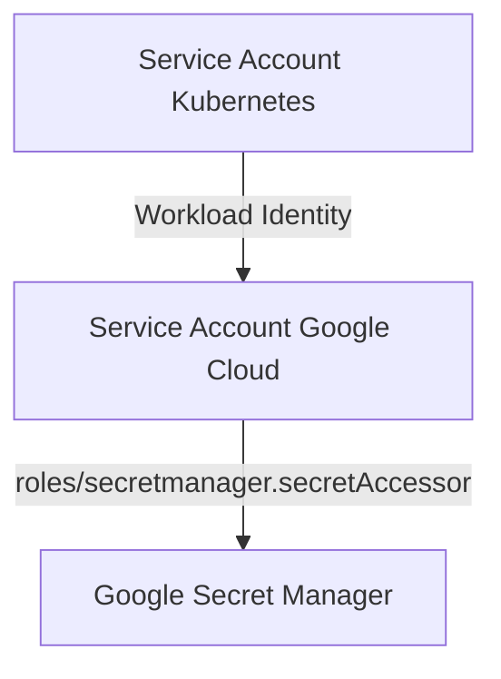

# Gestion des Service Accounts et des droits d'accès aux secrets dans Kubernetes


## 1. Configurer les IAM policies pour permettre l'accès aux secrets (GCP Secret Manager)

### 1. Identifier le Service Account utilisé
- Sur GKE avec Workload Identity : tu associes un Service Account Google Cloud (GSA) à un Service Account Kubernetes (KSA).
- Sinon : tu utilises le Service Account par défaut du nœud ou du pod.

### 2. Donner le rôle d'accès aux secrets
Le Service Account Google Cloud doit avoir le rôle suivant :
- `roles/secretmanager.secretAccessor` (permet de lire les secrets)

**Commande :**
```bash
gcloud projects add-iam-policy-binding VOTRE_PROJECT_ID \
  --member="serviceAccount:VOTRE_GSA@VOTRE_PROJECT_ID.iam.gserviceaccount.com" \
  --role="roles/secretmanager.secretAccessor"
```
Remplace VOTRE_PROJECT_ID par l’ID de ton projet GCP.
Remplace VOTRE_GSA par le nom de ton Service Account Google Cloud.

### 3. (Optionnel) Donner accès à d'autres ressources (Workload Identity)
```bash
gcloud iam service-accounts add-iam-policy-binding VOTRE_GSA@VOTRE_PROJECT_ID.iam.gserviceaccount.com \
  --role="roles/iam.workloadIdentityUser" \
  --member="serviceAccount:VOTRE_PROJECT_ID.svc.id.goog[MON_NAMESPACE/MON_KSA]"
```
MON_NAMESPACE : le namespace Kubernetes où se trouve ton pod
MON_KSA : le nom du Service Account Kubernetes utilisé par ton pod

### 4. Résumé visuel


### 5. Vérification
```bash
gcloud projects get-iam-policy VOTRE_PROJECT_ID \
  --flatten="bindings[].members" \
  --format='table(bindings.role)' \
  --filter="bindings.members:VOTRE_GSA@VOTRE_PROJECT_ID.iam.gserviceaccount.com"
```

---


## 2. Trouver le namespace Kubernetes d'un pod

### Lister tous les pods avec leur namespace
```bash
kubectl get pods --all-namespaces
```

### Lister les pods dans un namespace spécifique
```bash
kubectl get pods -n NOM_DU_NAMESPACE
```

### Trouver le namespace d'un pod précis
```bash
kubectl get pods --all-namespaces | grep NOM_DU_POD
```

### Depuis l'intérieur d'un pod
```bash
cat /var/run/secrets/kubernetes.io/serviceaccount/namespace
```

### Avec la commande describe
```bash
kubectl describe pod NOM_DU_POD --all-namespaces
```


---

## 3. Créer un Service Account Kubernetes

### Avec la ligne de commande
```bash
kubectl create serviceaccount NOM_DU_SERVICE_ACCOUNT -n NOM_DU_NAMESPACE
```
Exemple :
```bash
kubectl create serviceaccount sa-symfony-app -n default
```

### Avec un manifest YAML
```yaml
apiVersion: v1
kind: ServiceAccount
metadata:
  name: symfony-app
  namespace: default
```
Puis appliquer :
```bash
kubectl apply -f mon-service-account.yaml
```

### Vérifier la création
```bash
kubectl get serviceaccounts -n NOM_DU_NAMESPACE
```

### Utiliser ce Service Account dans un pod
Dans le manifest de ton pod ou deployment, ajoute :
```yaml
spec:
  serviceAccountName: sa-symfony-app
```


**Résumé :**
- Trouve le namespace de ton pod pour bien cibler tes ressources.
- Crée un Service Account Kubernetes pour tes pods.
- Donne les droits IAM nécessaires au Service Account Google Cloud pour accéder aux secrets.
- Utilise Workload Identity pour lier les deux si besoin. 